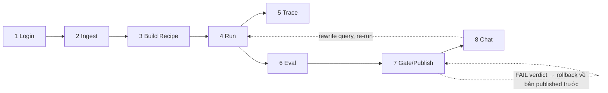

# Design-note SWE (D21) — User diagram + Flow diagram

> Neo: issue [`workbench#25`](https://github.com/AI20K-VGR/agentcore-studio-workbench/issues/25)
> (giao ở họp đầu Sprint 3, theo dõi ở [`kit#168`](https://github.com/AI20K-VGR/agentcore-studio-kit/issues/168)
> "Day 21"). Cả 2 diagram dưới đây dựng từ code thật (file:line trích dẫn ở mỗi bảng), không phải
> sơ đồ mẫu chung chung — phần nào chưa xác nhận được bằng code thì ghi rõ ở §3 Honest-TODO thay
> vì vẽ mập mờ.

## 1. User diagram — actor/role RBAC 3 tầng

```mermaid
flowchart TB
    L["POST /api/auth/login<br/>JWT: tenant_id · user · roles"]

    L --> SA
    L --> AD
    L --> EMP

    subgraph SA["Superadmin"]
        SA1["POST /api/admin/companies<br/>tạo công ty + admin đầu tiên"]
        SA2["CRUD /api/admin/sections<br/>DUY NHẤT nơi thêm/sửa/xoá phòng ban"]
    end

    subgraph AD["Admin — công ty"]
        AD1["CRUD /api/admin/users<br/>tạo/sửa role/vô hiệu hoá nhân viên"]
        AD2["GET /api/admin/sections<br/>chỉ đọc, đúng tenant mình"]
        AD3["Canvas: build · test · publish · rollback agent"]
        AD4["as_roles — giả lập chat theo role hẹp hơn<br/>chỉ THU HẸP, không CẤP THÊM<br/><i>(CHƯA merge — apps/studio#21)</i>"]
    end

    subgraph EMP["Employee"]
        EMP1["POST /api/agents/&#123;id&#125;/chat<br/>chỉ agent đã publish, đúng section_roles của mình"]
    end

    SA -. "tạo tài khoản admin đầu tiên" .-> AD
    AD -. "tạo tài khoản nhân viên" .-> EMP
```

**Sửa lại đợt review `workbench#26` (@TranBaDat2607) — 2 dòng dưới đây SAI khi bài này viết**: cả
hai trích từ working tree cục bộ lúc đó đã có sẵn nhánh `apps/studio#21` (RBAC sections/agents,
CHƯA merge vào `apps/studio` main) mà không ghi rõ — đọc như đang mô tả `main` hiện tại trong khi
thực ra mô tả 1 PR đang mở. `as_roles` grep case-insensitive trên TOÀN BỘ 9 submodule ra **0 hit**
ngoài nhánh đó; `routes/auth.py` trên `main` chỉ dài 165 dòng và `login()` không hề có đoạn mở
rộng role theo section — hàng "Admin tự động thừa hưởng…" đã bị XOÁ khỏi bảng dưới, thay bằng đúng
cơ chế đang sống thật trên `main`.

| Chi tiết | File:line |
|---|---|
| JWT claims (`tenant_id`/`user`/`roles`) | `apps/studio/src/studio_app/jwt_auth.py:99-132` |
| Admin nhận **đúng 1 lần**, lúc superadmin tạo công ty — KHÔNG phải mỗi lần login: `admin_roles = ["admin", *sorted(SECTION_VOCAB)]`, ghi cứng vào `core.users.roles` ngay lúc tạo | `apps/studio/src/studio_app/routes/admin.py:148` (trên `main`) |
| `SECTION_VOCAB` — vocabulary đóng cho section-role | `packages/kb/src/studio_kb/doc_factory.py:30` → `frozenset({"public", "hr", "finance", "engineering"})` |
| Superadmin companies/sections CRUD | `apps/studio/src/studio_app/routes/admin.py`, `routes/sections.py` |
| Admin employees CRUD + roles validate `core.sections ∪ {"admin"}` (thay `SECTION_VOCAB` tĩnh) | `routes/admin.py` — **CHƯA merge**, nhánh `apps/studio#21` |
| `as_roles` chỉ được thu hẹp, không cấp thêm quyền — mô phỏng chat theo role hẹp hơn cho admin tự kiểm | `apps/studio/src/studio_app/routes/chat.py` — **CHƯA merge**, nhánh `apps/studio#21` |

## 2. Flow diagram — 8 bước spine (`login → ingest → build recipe → run → trace → eval → gate/publish → chat`)

| Bước | Cơ chế thật | File:line |
|---|---|---|
| **1. Login** | `login()` verify mật khẩu, phát JWT | `apps/studio/src/studio_app/routes/auth.py:97` |
| **2. Ingest** | `doc_factory.py::load_callisto()` — nguồn ingest THẬT (không phải `KbPipeline`, module đó vẫn 5/5 method `NotImplementedError`) | `packages/kb/src/studio_kb/doc_factory.py:167`, `pipeline.py:22-45` |
| **3. Build recipe** | Canvas (`apps/web`) → `buildRecipe()`; server-side `create_dynamic_recipe()`/`create_recipe_d4()`. `graph_lint()` chạy SAU khi dựng recipe, độc lập ở từng điểm gọi | `packages/workbench/src/studio_workbench/builder.py:96-138`, `validator.py:49` |
| **4. Run** | `POST /api/runs` → `graph_lint()` → `interpreter.run()` dispatch 6 executor (kb-retrieve/llm-step/condition/tool-call/hitl-pause/end), mỗi node ghi 1 `TraceEvent` | `apps/studio/src/studio_app/routes/runs.py:69-144`, `packages/engine/src/studio_engine/interpreter.py:160-244` |
| **5. Trace** | `GET /api/runs/{run_id}` đọc `obs.trace_events` — bảng này **KHÔNG có RLS**, tenant fence chỉ ở `WHERE` tầng đọc | `routes/runs.py:156-173`, `packages/kb/src/studio_kb/cost.py:84,128` |
| **6. Eval** | `EvalHarness.run()` chạy golden set qua `EngineAgentRunner`→`interpreter.run()`, chấm exact-match + `LLMJudge` fallback khi cần | `packages/evalhub/src/studio_evalhub/harness.py:463-595`, `apps/studio/src/studio_app/eval_adapter.py` |
| **7. Gate/Publish** | `compute_scorecard()` → `gate.verdict`; `publish()` fail-closed 3 lớp: `graph_lint` lại, `recipe_hash is None` → luôn 409 hôm nay (chưa có producer, DEC-03), `verdict==FAIL` → chặn + rollback về bản published trước | `packages/evalhub/src/studio_evalhub/compute.py:107-131`, `packages/workbench/src/studio_workbench/publish.py:63-119` |
| **8. Chat** | Load recipe đã publish (RLS + double-check tenant), viết đè `query` theo tin nhắn, `graph_lint` lại rồi `interpreter.run()` | `apps/studio/src/studio_app/routes/chat.py:53-116` |

### Enforcement kép — cross-cutting, không phải lỗi hiển thị

`interpreter.run()` **luôn ghi đè** `tenant_id`/`section_roles` từ session, bất kể recipe khai
gì (`packages/engine/src/studio_engine/interpreter.py:280-328`) — kết hợp RLS thật trên
`kb.chunks` (`FORCE ROW LEVEL SECURITY`, `packages/kb/src/studio_kb/postgres.py:111-113`). Ngoại
lệ có chủ đích: `obs.trace_events` không có RLS (§ bước 5) — honest asymmetry, không phải bug.

## 3. Honest-TODO

| Món | Chủ | Điều kiện lật |
|---|---|---|
| `condition`/`hitl-pause` chưa có golden case/demo path thật nào đi qua (kế thừa từ `swe-day20-node-type-tradeoffs.md` §3, chưa đổi tính tới D21) | chưa có chủ | ≥1 golden case dùng `condition`; ≥1 demo path dùng `hitl-pause` |
| `POST /publish` hôm nay LUÔN 409 (`recipe_hash is None`, DEC-03) — chưa có producer nối `recipe_hash` | chưa có chủ | 1 route/step gán `scorecard.recipe_hash` thật trước khi gọi `publish()` |
| `obs.trace_events` không có RLS (chỉ enforce qua `WHERE` tầng đọc) — honest gap, chưa phải bug vì chưa có báo cáo rò rỉ thật | chưa có chủ | quyết định có cần RLS cho bảng này hay giữ nguyên (viết ADR nếu giữ nguyên có chủ đích) |

## 4. Dọn kèm — `packages/workbench/src/studio_workbench/builder.py`

Đọc code cho diagram §2 phát hiện `create_sample_recipe_d3`/alias `create_recipe_d3` không có
caller nào ngoài `packages/workbench` (đã grep toàn bộ 7 submodule: `apps/studio`, `apps/web`,
`packages/engine`, `packages/kb`, `packages/evalhub`, `packages/contracts` — 0 hit production, 0
hit test ngoài package này). Hành vi là tập con thật sự của `create_recipe_d4` (cùng shape 4-node,
`create_recipe_d4` tổng quát hơn). Đã xoá cùng đợt (không nằm trong DoD gốc của `workbench#25`,
làm thêm vì phát sinh tự nhiên lúc đọc code cho flow diagram):

- `create_sample_recipe_d3` + alias `create_recipe_d3` khỏi `builder.py` (và `__all__`/`__init__.py`).
- `tests/test_wiring_d3.py` (3 case, chỉ target 2 hàm vừa xoá).
- Phần gọi `create_recipe_d3` trong `tests/test_builder.py::test_legacy_builders_compatibility`
  (giữ lại phần d4/d6 của bài test).

**Không đụng** `create_recipe_d6`/`_parse_kb_scope` dù ít nơi gọi thật (chỉ
`scripts/smoke_eval_d6.py`, chạy tay không qua CI) — 2 hàm này đang giữ regression coverage cho 1
lần đảo quyết định bảo mật (`kit#92`/`workbench#17`: `_parse_kb_scope` CỐ Ý permissive sau khi
strict-check từng làm vỡ `packages/kb/tests/test_spine_live.py` — bài test INV-1 sống cần build
được recipe với slug/tenant KHÔNG khớp để test đúng "session luôn thắng recipe"). Xoá sẽ mất luôn
regression coverage cho 1 quyết định bảo mật đã có tiền lệ đảo ngược — rủi ro thật, không phải lý
thuyết.

**Verify** (`packages/workbench`, `uv run python -m <tool>` — bản `uv run <tool>` trần bị
Application Control Policy chặn trên máy này):
- `pytest -q` → **96 passed, 3 skipped** (giảm đúng 3 case của `test_wiring_d3.py`, 0 case khác đỏ).
- `ruff check` → sạch. `ruff format --check` → 22 file đã đúng format.
- `mypy` → sạch, 22 file. `lint-imports` → 1 kept, 0 broken (layer contract không đổi).
